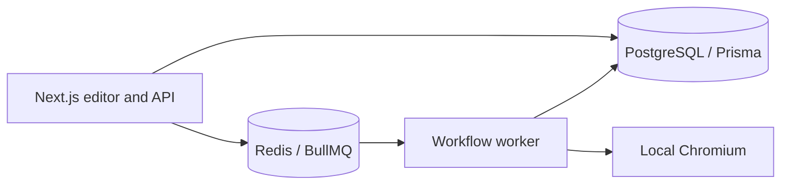

# AIScrape

AIScrape is a Next.js workflow editor with a PostgreSQL execution history, Redis/BullMQ worker, and local Chromium browser tasks. The local queue/browser smoke uses temporary synthetic account data and a public test page.

## Quick Start

On Linux or Windows with WSL2 and Docker Desktop (WSL integration enabled):

```bash
git clone https://github.com/abhisek343/AIScrape.git
cd AIScrape
cp .env.example .env
sed -i 's/^SCRAPE_ROBOTS_MODE=.*/SCRAPE_ROBOTS_MODE=advisory/' .env
docker compose up --build -d
docker compose exec -T worker npx tsx scripts/compose-worker-smoke.ts
docker compose logs --tail=50 worker
```

The advisory robots setting above matches CI for this controlled local smoke against the allowed public test page. It avoids failing the demo when that site's robots.txt endpoint is unavailable; destination and SSRF checks still apply. `.env.example` retains strict robots handling as the default for other use.

Open http://localhost:3000 for the landing page. The smoke submits a two-node browser → HTML workflow, checks the persisted output, and deletes its temporary records. For the authenticated workflow editor, configure your own Clerk test keys in `.env`. The placeholder keys do not provide login. Stripe, Gemini, and managed browser integrations likewise require their own credentials. Never commit `.env`.

## Interview Demo — 5 Minutes

1. Open this README and the architecture sketch below; point to the Next.js web process, PostgreSQL, Redis queue, and worker.
2. Show the landing page at `localhost:3000` and `docker compose ps` for service state.
3. Run the smoke command above; explain the linked `LAUNCH_BROWSER` → `PAGE_TO_HTML` nodes and the IANA test target. Show the `compose-worker-smoke.completed` JSON line with `htmlBytes` and the worker `job.started`/`job.completed` lines.
4. Show `lib/scraping/target-policy.ts` and its tests, then try a private address in a locally defined workflow to demonstrate rejection. The editor and run-history UI need valid Clerk test keys; with those keys, create the same two nodes in the editor and view execution phases in Runs.
5. Show `docker compose exec -T redis redis-cli ping` and the queue retry/dead-letter configuration in `lib/queue/workflow.queue.ts`.

This credential-free command-line demo verifies browser extraction and worker persistence. It does not demonstrate authenticated UI creation or third-party billing/AI features.

## Architecture Decisions



Execution IDs become BullMQ job IDs for duplicate submission protection. The worker owns browser execution so web requests can return promptly. The target policy validates destinations and DNS before requests; keep the host allowlist narrow for shared deployments. Local Chromium avoids a paid browser service, at the cost of a larger image and per-worker browser resource limits. This is a reference implementation with a tested local smoke path, not evidence of third-party integrations or broad production load testing.

## ✨ Features

- **Visual Workflow Builder:** Drag-and-drop interface to create complex scraping logic without writing code.
- **Rich Node Library:** 25+ nodes including navigation, inputs, extraction, HTTP calls, screenshots, regex, infinite scroll, waits, and more.
- **AI Assistant (Chatbot):** Context-aware guidance for building flows. Supports an optional Automation Mode that can create, update, and run workflows from a strict JSON spec.
- **AI-Powered Data Extraction:** Use AI to extract structured data from text/HTML.
- **Advanced Browser Controls:** Set viewport, user agent, cookies, localStorage; hover and type; wait for navigation or network idle.
- **HTTP Requests:** Call external APIs directly within workflows.
- **Scheduled Executions:** Set up cron jobs to run your workflows at regular intervals.
- **Secure Credential Management:** Safely store and use credentials for sites and providers.
- **Real-time Monitoring:** Track the progress and results of workflow executions.
- **Data Delivery:** Send extracted data to your systems via webhooks.

## 🛠️ Tech Stack

- **Next.js** – 
- **TypeScript** – 
- **Tailwind CSS** – 
- **Prisma** – 
- **Stripe** – 
- **React Flow** – 

## 🚀 Getting Started

### Prerequisites

- Node.js 20 for host-side commands, npm, and Docker Compose

### Installation

1.  **Clone the repository:**
    ```bash
    git clone https://github.com/abhisek343/AIScrape.git
    cd AIScrape
    ```

2.  **Install dependencies:**
    ```bash
    npm ci
    ```

3.  **Start the reproducible local stack:**
    ```bash
    cp .env.example .env
    docker compose up --build
    ```
    This starts PostgreSQL, Redis, a migration job, the Next.js web process,
    and the BullMQ worker. See [the operations runbook](docs/OPERATIONS.md) for
    queue semantics, observability, deployment, rollback, and target policy.

     Required for the chatbot assistant:
     - `GOOGLE_API_KEY` — for Generative AI (Gemini) features used by the in-app chatbot.
     - `GEMINI_ENABLE_GOOGLE_SEARCH` — set to `true` to enable Google Search Grounding for up-to-date web answers.

4.  **Or run the development server:**
    ```bash
    npm run dev
    ```

Open [http://localhost:3000](http://localhost:3000) with your browser to see the result.

### Responsible use

AIScrape is for targets you are authorized to automate. It rejects private,
loopback, metadata, and non-HTTP(S) targets before a browser opens. In shared
environments set `SCRAPE_ALLOWED_HOSTS` to a comma-separated allowlist, respect
robots directives and terms of service, rate-limit per target, and never use a
workflow to bypass authentication, access controls, CAPTCHAs, or paywalls.

## 🧩 Supported Workflow Nodes

Grouped highlights of currently available nodes (see in-app Task Menu for full details):

- **Browser & Navigation**
  - `LAUNCH_BROWSER`, `NAVIGATE_URL`, `SCROLL_TO_ELEMENT`, `WAIT_FOR_NAVIGATION`, `WAIT_FOR_NETWORK_IDLE`, `INFINITE_SCROLL`
- **Interaction**
  - `CLICK_ELEMENT`, `FILL_INPUT`, `HOVER_ELEMENT`, `KEYBOARD_TYPE`
- **Extraction**
  - `PAGE_TO_HTML`, `EXTRACT_TEXT_FROM_ELEMENT`, `EXTRACT_ATTRIBUTES`, `EXTRACT_LIST`, `REGEX_EXTRACT`, `SCREENSHOT`
- **Data & Integrations**
  - `EXTRACT_DATA_WITH_AI`, `HTTP_REQUEST`, `DELIVER_VIA_WEBHOOK`
- **JSON Utilities**
  - `READ_PROPERTY_FROM_JSON`, `ADD_PROPERTY_TO_JSON`
- **Environment Controls**
  - `SET_VIEWPORT`, `SET_USER_AGENT`, `SET_COOKIES`, `SET_LOCAL_STORAGE`
- **Timing**
  - `WAIT_FOR_ELEMENT`, `DELAY`

Each node documents its required inputs and outputs in the editor. Credits (where applicable) are shown in the UI.

## 💬 Chatbot Assistant and Automation Mode

- **Context-aware helper:** The chatbot can inspect the currently open workflow to explain steps and suggest improvements. It also generates Mermaid diagrams to visualize suggested flows.
- **Automation Mode (optional):** If you explicitly ask to automate/create/update a workflow, the chatbot can output a strict JSON object that the app will parse to create/update and optionally run a workflow.

Automation is off by default. To automate, explicitly say something like "automation on", "automate", "create a workflow", or "update the workflow". Otherwise, the chatbot will only provide guidance and diagrams without executing anything.

Automation JSON shape (example):

```json
{
  "action": "CREATE_AND_RUN",
  "workflow": {
    "name": "My Example Flow",
    "description": "Navigate and capture page HTML",
    "nodes": [
      { "key": "A", "type": "LAUNCH_BROWSER", "inputs": { "Website Url": "https://example.com" } },
      { "key": "B", "type": "PAGE_TO_HTML" }
    ],
    "edges": [
      { "from": { "node": "A", "output": "Web page" }, "to": { "node": "B", "input": "Web page" } }
    ]
  }
}
```

Notes:
- Types must match node names exactly (see Supported Workflow Nodes).
- Inputs must match the node’s input names exactly.
- For `UPDATE_ONLY` and `UPDATE_AND_RUN`, the currently open workflow is the update target and you should omit the name.

### Slash commands (experimental)

- You can trigger quick, smooth auto-creation directly from the chat input using slash-style commands.
- Example: `/ extract image from wikipedia page chicken`
  - Creates a 3-node flow: `LAUNCH_BROWSER` → `PAGE_TO_HTML` → `EXTRACT_ATTRIBUTES` (img/src), auto-connects, and starts a run.
  - The editor refreshes so you see nodes connected with inputs prefilled.
  - Endpoint: `POST /api/workflows/slash` with `{ command }`.

## 🤝 Contributing

Contributions are welcome! Please feel free to submit a pull request or open an issue.

1.  Fork the Project
2.  Create your Feature Branch (`git checkout -b feature/AmazingFeature`)
3.  Commit your Changes (`git commit -m 'Add some AmazingFeature'`)
4.  Push to the Branch (`git push origin feature/AmazingFeature`)
5.  Open a Pull Request

## 📄 License

This project is licensed under the MIT License - see the [LICENSE](LICENSE) file for details.

## Cloud demo

[](docs/demo/aiscrape-demo.mp4)

This recording is generated on a clean GitHub Actions Ubuntu runner. It boots PostgreSQL, Redis, the migration job, the Next.js web application, and the BullMQ worker, then records the running application after exercising a real browser-worker job.

To reproduce locally:

    cp .env.example .env
    docker compose up --build

The local application is available at http://localhost:3000. Authentication, Gemini, Stripe, and production browser-provider integrations require deployment-owned credentials.
