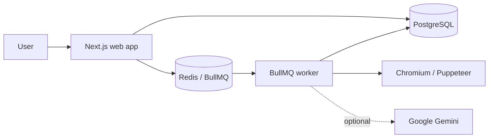

# AIScrape

**Visual browser automation and data-extraction workflows with a queue-backed execution engine.**

[](https://github.com/abhisek343/AIScrape/actions/workflows/ci.yml)

AIScrape lets users compose browser and data tasks as a graph, persist an execution plan, and run that plan asynchronously through Redis/BullMQ workers. The worker owns Chromium execution; PostgreSQL stores workflow, execution, phase, and log state.

The core local path is reproducible without paid infrastructure: PostgreSQL, Redis, the Next.js application, a BullMQ worker, and local Chromium all run through Docker Compose.

[](docs/demo/aiscrape-demo.mp4)

> The recording is generated from the repository's Compose-based demo path. Authentication, billing, Gemini, and managed-browser integrations require deployment-owned test credentials.

## Engineering highlights

- **Queue-backed execution** — workflow requests are persisted and submitted to BullMQ instead of running browser automation inside the web request.
- **Duplicate-run protection** — a workflow execution ID is also used as the BullMQ job ID, preventing duplicate submissions of the same execution from creating a second concurrent job.
- **Retries and dead-letter handling** — jobs retry up to three times with exponential backoff; terminal failures are mirrored into a dedicated dead-letter queue.
- **Dependency-aware execution** — the workflow planner validates the graph and groups independent work into execution phases that can run concurrently.
- **Durable execution state** — workflow status, phase status, outputs, credit usage, and execution logs are persisted in PostgreSQL.
- **Browser-target safety** — outbound targets are restricted to HTTP(S), resolved before use, checked against private/loopback/link-local/reserved address ranges, and optionally constrained by a host allowlist.
- **Responsible crawling controls** — robots-policy handling and Redis-backed per-host pacing are part of the browser path.
- **Reproducible verification** — CI runs tests, linting, a production build, the Docker Compose stack, and a real worker → Chromium → persisted HTML smoke test.

## Architecture



### Execution path

1. A workflow graph is validated and compiled into persisted execution phases.
2. The web process creates a workflow execution and submits its ID to BullMQ.
3. A standalone worker consumes the job and loads the persisted execution plan.
4. Independent phases may execute concurrently; dependent phases retain ordering.
5. Browser and data-task outputs are passed through the execution environment and persisted.
6. Completion/failure state is written atomically, with protection against an older run overwriting the status of a newer run.
7. Terminal queue failures are copied to the dead-letter queue for inspection.

See [SYSTEM_DESIGN.md](SYSTEM_DESIGN.md) for the design in more detail and [docs/OPERATIONS.md](docs/OPERATIONS.md) for local operations, queue behavior, deployment notes, and target policy.

## Core stack

| Area | Technology |
| --- | --- |
| Web application | Next.js 15, React 18, TypeScript |
| Workflow editor | XYFlow / React Flow |
| Persistence | PostgreSQL, Prisma |
| Queue | Redis, BullMQ |
| Browser execution | Puppeteer + Chromium |
| Authentication | Clerk |
| AI integration | Google Gemini |
| Billing | Stripe |
| Local runtime | Docker Compose |
| Deployment baseline | Docker, Kubernetes manifests |
| CI | GitHub Actions |

## Workflow capabilities

AIScrape currently includes browser, extraction, data, integration, and timing tasks such as:

- **Browser/navigation:** `LAUNCH_BROWSER`, `NAVIGATE_URL`, `SCROLL_TO_ELEMENT`, `INFINITE_SCROLL`
- **Interaction:** `CLICK_ELEMENT`, `FILL_INPUT`, `HOVER_ELEMENT`, `KEYBOARD_TYPE`
- **Extraction:** `PAGE_TO_HTML`, `EXTRACT_TEXT_FROM_ELEMENT`, `EXTRACT_ATTRIBUTES`, `EXTRACT_LIST`, `REGEX_EXTRACT`, `SCREENSHOT`
- **Data/integrations:** `HTTP_REQUEST`, `DELIVER_VIA_WEBHOOK`, `EXTRACT_DATA_WITH_AI`
- **Browser context:** `SET_VIEWPORT`, `SET_USER_AGENT`, `SET_COOKIES`, `SET_LOCAL_STORAGE`
- **Synchronization:** `WAIT_FOR_ELEMENT`, `WAIT_FOR_NAVIGATION`, `WAIT_FOR_NETWORK_IDLE`, `DELAY`

The task registry is the source of truth for supported nodes: [`lib/workflow/task/registry.tsx`](lib/workflow/task/registry.tsx).

## Quick start

### Requirements

- Node.js 20
- Docker Engine + Docker Compose, or Docker Desktop
- Git

### Start the local stack

```bash
git clone https://github.com/abhisek343/AIScrape.git
cd AIScrape
cp .env.example .env
docker compose up --build -d
```

Open **http://localhost:3000**.

The placeholder Clerk key is sufficient to build and serve the public landing page, but it does **not** provide an authenticated session. Use your own Clerk test credentials to use authenticated workflow screens.

### Run the real worker/browser smoke test

The smoke fixture uses a public test target. For this controlled fixture, set the following in your local `.env`:

```dotenv
SCRAPE_ROBOTS_MODE=advisory
```

Then run:

```bash
docker compose exec -T worker npx tsx scripts/compose-worker-smoke.ts
docker compose logs --tail=50 worker
```

A successful run exercises Redis enqueueing, BullMQ worker execution, local Chromium, HTML extraction, PostgreSQL persistence, and cleanup of the temporary workflow data.

To inspect infrastructure state:

```bash
docker compose ps
docker compose exec -T redis redis-cli ping
```

## Optional integrations

The core queue/browser smoke does not require production credentials. These features do:

| Feature | Configuration |
| --- | --- |
| Authenticated UI | `CLERK_SECRET_KEY`, `NEXT_PUBLIC_CLERK_PUBLISHABLE_KEY` |
| Gemini features | `GOOGLE_API_KEY` |
| Google Search grounding | `GEMINI_ENABLE_GOOGLE_SEARCH=true` |
| Scheduled execution | `API_SECRET` |
| Encrypted stored credentials | `ENCRYPTION_KEY` |
| Stripe billing | `STRIPE_SECRET_KEY`, `STRIPE_WEBHOOK_SECRET` |
| Remote browser mode | `BROWSER_MODE=remote`, `BRIGHT_DATA_BROWSER_WS` — currently restricted to literal public-IP targets because hostname DNS pinning cannot be enforced through the remote endpoint |

Never commit a populated `.env`.

## Development

Install dependencies:

```bash
npm ci
```

Run the web application and worker in development:

```bash
npm run dev
```

Run the automated checks used by CI:

```bash
npm test -- --runInBand
npm run lint
npm run build
```

### Queue enqueue benchmark

`scripts/load-test.ts` is an **enqueue-path benchmark**, not an end-to-end browser throughput benchmark. It measures how quickly producers can submit jobs to Redis/BullMQ under bounded producer concurrency.

Run it with Redis available:

```bash
npm run benchmark:queue
# optional: producer concurrency, total jobs
npm run benchmark:queue -- 50 5000
```

It must not be used as evidence for browser-execution throughput, maximum supported users, or production capacity.

## Repository map

```text
app/                     Next.js routes, API handlers, workflow/runs UI
actions/                 Server-side workflow, billing, analytics, credential actions
lib/workflow/            Planning, execution engine, task and executor registries
lib/queue/               BullMQ queue, retry and dead-letter configuration
lib/scraping/            Target policy, robots policy, response limits, rate limiting
prisma/                  Schema and migrations
scripts/                 Compose smoke, queue benchmark, local utilities
docs/OPERATIONS.md       Operations and deployment notes
docs/DEVELOPMENT.md      Task-extension and verification notes
SYSTEM_DESIGN.md         Architecture and execution design
worker.ts                Standalone BullMQ worker process
compose.yaml             Reproducible PostgreSQL + Redis + web + worker stack
```

## CI verification

The GitHub Actions pipeline verifies two layers:

**Application checks**

```text
npm ci
npm test -- --runInBand
npm run lint
npm run build
```

**Integration smoke**

```text
PostgreSQL + Redis
        ↓
Prisma migrations
        ↓
Next.js web + BullMQ worker
        ↓
real queued job
        ↓
local Chromium
        ↓
PAGE_TO_HTML
        ↓
persisted output assertion
```

This is intentionally narrower than a production load claim: it proves the checked-in stack can execute the core browser workflow path from a clean CI runner.

## Security and responsible use

AIScrape is intended for targets you are authorized to automate.

The browser path rejects non-HTTP(S) URLs and private, loopback, link-local, metadata-style, and reserved network destinations. Shared deployments should configure a narrow `SCRAPE_ALLOWED_HOSTS` list, use conservative per-host pacing, respect robots directives and target terms, and avoid workflows intended to bypass authentication, CAPTCHAs, paywalls, or access controls.

See [docs/OPERATIONS.md](docs/OPERATIONS.md#target-and-compliance-policy) for operational guidance.

## Project scope

AIScrape is a portfolio/reference implementation of a visual browser-automation system with a reproducible local execution path.

What the repository **does verify**:

- application tests and production build
- queue submission and worker consumption
- local Chromium execution
- persisted browser output
- retry/DLQ configuration
- target-policy and robots-policy behavior

What it **does not claim** without external credentials or separate benchmarking:

- production-scale browser throughput
- availability/SLA guarantees
- correctness of third-party Clerk, Stripe, Gemini, or managed-browser accounts
- unrestricted compatibility with arbitrary websites

That distinction is deliberate: the repository documents what can be reproduced from the codebase rather than presenting unverified production claims.
