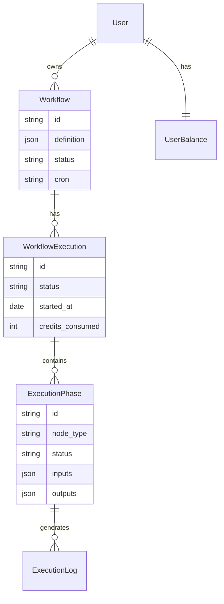
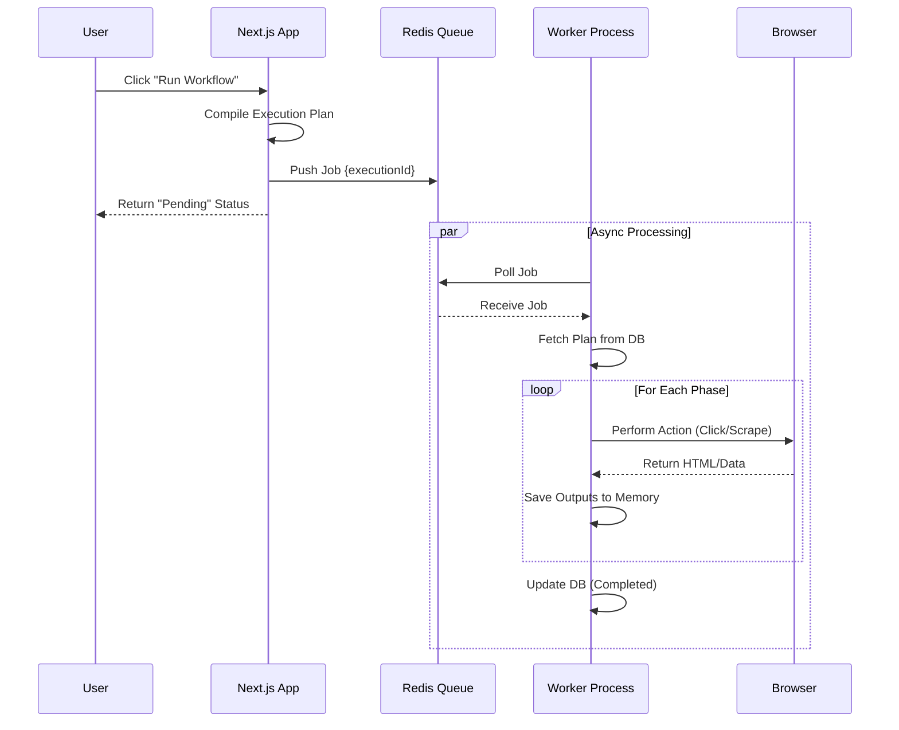

# AIScrape - System Architecture & Design Document

## 1. Project Overview
**AIScrape** is a visual workflow automation platform designed to democratize web scraping. It facilitates the creation of complex data extraction pipelines using a "No-Code/Low-Code" node-based editor, augmented by Generative AI (Google Gemini) for intelligent parsing.

### Key Features
- **Visual Workflow Builder**: Intuitive Drag-and-Drop interface.
- **AI-Powered Extraction**: "Smart" nodes that understand page context.
- **Distributed Execution**: Robust, queued background processing.
- **Scheduler**: Cron-based automated runs.
- **Billing Integration**: Credit-based usage model via Stripe.

---

## 2. System Architecture

The system follows a **Modern Distributed Monolith** architecture. While the codebase resides in a single repository (Next.js), the runtime execution is decoupled into distinct services.

### High-Level Architecture Diagram
```mermaid
graph TD
    User[User / Client] -->|HTTPS| WebApp[Next.js Web Application]
    
    subgraph "Application Layer"
        WebApp -->|Server Actions| API[Internal API / Server Actions]
        WebApp -->|Frontend| Editor[React Flow Editor]
    end

    subgraph "Data Layer"
        API -->|Read/Write| DB[(PostgreSQL + Neon)]
        API -->|Enqueue Job| Redis[(Redis Queue)]
    end

    subgraph "Worker Layer"
        Worker[Node.js Worker Service] -->|Poll| Redis
        Worker -->|Update Status| DB
        Worker -->|Control| Browser[Headless Browser (Puppeteer)]
        Worker -->|Inference| AI[Google Gemini API]
    end
```

### Component Description
1.  **Web Application (Next.js 14)**: Handles UI, Authentication (Clerk), and Workflow Management.
2.  **PostgreSQL (Neon)**: Primary source of truth. Stores User data, Workflow definitions, and Execution logs.
3.  **Redis (BullMQ)**: persistent message broker. Ensures workflow execution requests are not lost if the web server restarts.
4.  **Worker Service**: A standalone Node.js process that:
    - Consumes jobs from Redis.
    - Launches Headless Chrome (Puppeteer).
    - Executes the logic graph.
    - Interacts with AI models.

---

## 3. Database Design

The database schema is designed for relational integrity and auditability.

### Entity Relationship Diagram (ERD)


### Key Tables
-   **Workflow**: Contains the JSON "blueprint" of the automation.
-   **WorkflowExecution**: Represents a single run instance. Tracks global status (PENDING, RUNNING, COMPLETED, FAILED).
-   **ExecutionPhase**: Granular atomic units of work (e.g., "Click Button", "Extract Text").
-   **ExecutionLog**: High-volume text logs for debugging.

---

## 4. Core Logic: The Workflow Engine

### 4.1. Execution Planning (Compiler)
Before running, the visual graph is compiled into a linear execution plan using **Topological Sorting**.
1.  **Validation**: Checks for cycles and missing inputs.
2.  **Phasing**: Groups independent nodes into "Phases" that can run in parallel.
    - *Example*: "Extract Title" and "Extract Image" can run in the same phase after "Navigate to URL".

### 4.2. Distributed Execution Flow


---

## 5. Technology Stack

| Layer | Technology | Reason |
| :--- | :--- | :--- |
| **Frontend** | React, Next.js 14, Tailwind | Performance, SEO, Server Components. |
| **Visuals** | React Flow, Shadcn UI | Best-in-class libraries for node editors and accessible UI. |
| **Backend** | Node.js, Server Actions | Unified Typescript codebase. |
| **Database** | PostgreSQL, Prisma ORM | Type-safe database queries. |
| **Queue** | Redis, BullMQ | Reliability and retries. |
| **Scraping** | Puppeteer | Full browser automation (needed for SPAs). |
| **AI** | Google Gemini | Cost-effective, high-context window LLM. |

## 6. Scalability & Future Roadmap

### Current Bottlenecks
-   **Browser Resource**: Headless browsers are RAM heavy. A single worker node can handle ~10 concurrent browsers.
-   **Long-Running Connections**: Database connections in Serverless environments.

### Roadmap
1.  **Browser Grid**: Offload Puppeteer execution to a managed service (e.g., BrightData) to scale to thousands of concurrent threads.
2.  **Webhooks**: Add support for triggering external APIs upon workflow completion.
3.  **Templates Marketplace**: Allow users to share and clone workflow templates.
