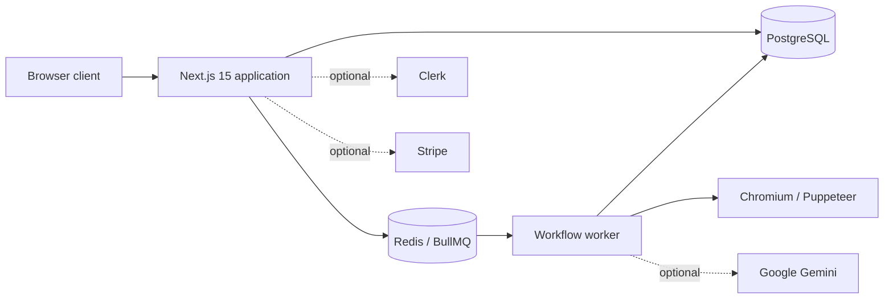
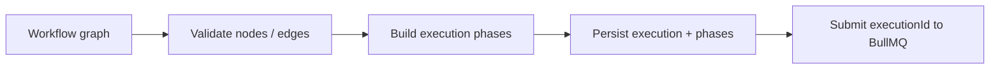
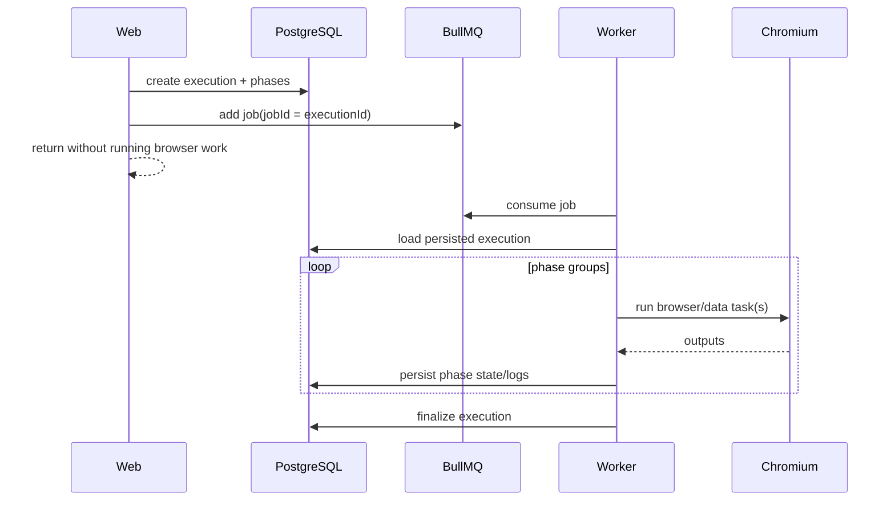
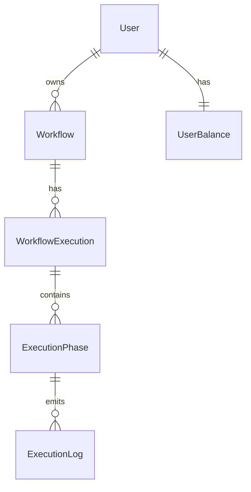

# AIScrape System Design

## 1. Overview

AIScrape is a visual browser-automation and data-extraction application. Users define workflows as node graphs; the web application validates and persists an execution plan, then submits the execution to Redis/BullMQ. A separate worker process performs browser and data tasks and writes execution state back to PostgreSQL.

The repository is a **single codebase with multiple runtime processes**:

- Next.js web application
- PostgreSQL database
- Redis/BullMQ queue
- standalone workflow worker
- Chromium/Puppeteer browser runtime

This separation keeps long-running browser work out of the HTTP request path while preserving one TypeScript codebase.

## 2. High-level architecture


```mermaid
flowchart LR
    Client[Browser client] --> Web[Next.js 15 application]

    Web --> DB[(PostgreSQL)]
    Web --> Queue[(Redis / BullMQ)]

    Queue --> Worker[Workflow worker]
    Worker --> DB
    Worker --> Browser[Chromium / Puppeteer]

    Worker -. optional .-> Gemini[Google Gemini]
    Web -. optional .-> Clerk[Clerk]
    Web -. optional .-> Stripe[Stripe]
```

### Component responsibilities

| Component | Responsibility |
| --- | --- |
| Next.js application | UI, authentication boundary, workflow CRUD, execution creation, API/server actions |
| PostgreSQL / Prisma | source of truth for workflows, executions, phases, logs, credentials metadata, billing state |
| Redis / BullMQ | durable job handoff, retries, duplicate-job protection, dead-letter queue |
| Worker | loads persisted executions, runs phases, records results and failures |
| Chromium / Puppeteer | browser navigation, interaction, rendering, and extraction |
| Optional providers | Clerk authentication, Gemini inference, Stripe billing, remote browser mode |

PostgreSQL may be local (Compose) or managed in deployment. The architecture does not depend on a specific hosted PostgreSQL vendor.

## 3. Workflow model

A workflow definition contains nodes and edges created in the visual editor.

Before execution, AIScrape validates the graph and creates a persisted execution plan. The planner rejects invalid dependency structures and assigns nodes to numbered phases so independent work can execute together where safe.


```mermaid
flowchart LR
    Graph[Workflow graph] --> Validate[Validate nodes / edges]
    Validate --> Plan[Build execution phases]
    Plan --> Persist[Persist execution + phases]
    Persist --> Enqueue[Submit executionId to BullMQ]
```

### Execution environment

During a run, the worker maintains an execution environment containing values produced by prior nodes and browser resources such as Puppeteer browser/page instances. Task executors read declared inputs and publish outputs for downstream nodes.

The task registry defines the workflow surface; the executor registry maps each task type to runtime behavior.

Relevant code:

- `lib/workflow/execution-plan.ts`
- `lib/workflow/execute-workflow.ts`
- `lib/workflow/task/registry.tsx`
- `lib/workflow/executor/registry.ts`

## 4. Queue and failure semantics

AIScrape uses the workflow execution ID as the BullMQ job ID.

That choice provides an idempotency boundary at queue submission: re-submitting the same execution cannot create a second job with a different identity.

Default workflow job behavior:

- 3 attempts
- exponential backoff beginning at 1 second
- completed jobs removed
- failed jobs retained for inspection
- terminal failures copied to `workflow-execution-dead-letter-queue`

The worker currently processes up to five jobs concurrently. That is a configured worker concurrency value, **not** a production-capacity claim.


```mermaid
sequenceDiagram
    participant W as Web
    participant DB as PostgreSQL
    participant Q as BullMQ
    participant K as Worker
    participant B as Chromium

    W->>DB: create execution + phases
    W->>Q: add job(jobId = executionId)
    W-->>W: return without running browser work

    K->>Q: consume job
    K->>DB: load persisted execution
    loop phase groups
        K->>B: run browser/data task(s)
        B-->>K: outputs
        K->>DB: persist phase state/logs
    end
    K->>DB: finalize execution
```

### Status consistency

Execution finalization uses database transactions for related status updates. Workflow status updates are guarded by `lastRunId` so an older execution cannot overwrite the visible status of a newer execution that has already started.

## 5. Persistence model

The core execution hierarchy is:


```mermaid
erDiagram
    User ||--o{ Workflow : owns
    Workflow ||--o{ WorkflowExecution : has
    WorkflowExecution ||--o{ ExecutionPhase : contains
    ExecutionPhase ||--o{ ExecutionLog : emits
    User ||--|| UserBalance : has
```

Important entities:

- **Workflow** — persisted graph definition and scheduling metadata
- **WorkflowExecution** — one workflow run and its aggregate status
- **ExecutionPhase** — persisted unit of planned work
- **ExecutionLog** — execution-level diagnostic output
- **UserBalance / purchase records** — credit accounting used by billing-related features

The Prisma schema and migrations are under `prisma/`.

## 6. Browser target safety

Browser automation creates an SSRF and network-access boundary, so AIScrape validates targets before navigation.

The target policy:

- accepts only HTTP and HTTPS
- rejects embedded URL credentials
- rejects localhost and private/loopback/link-local/reserved IP ranges
- resolves hostnames and rejects non-public DNS answers
- fails closed when a target cannot be safely resolved
- supports a deployment-level `SCRAPE_ALLOWED_HOSTS` allowlist

The browser path also includes robots-policy handling and Redis-backed per-host pacing.

Relevant code:

- `lib/scraping/target-policy.ts`
- `lib/scraping/robots-policy.ts`
- `lib/scraping/rate-limit.ts`

These controls reduce accidental or unsafe network access; they are not a claim that arbitrary third-party targets are safe or authorized to automate.

## 7. Local runtime

`compose.yaml` starts:

- PostgreSQL 16
- Redis 7
- Prisma migration job
- Next.js web process
- BullMQ worker

The application image includes Chromium and uses `BROWSER_MODE=local` for the reproducible demo path.

```bash
cp .env.example .env
docker compose up --build -d
```

The integration smoke test submits a temporary workflow through the real queue, launches Chromium in the worker, extracts HTML from a controlled public target, asserts persisted output, and removes temporary data.

```bash
docker compose exec -T worker npx tsx scripts/compose-worker-smoke.ts
```

See `docs/OPERATIONS.md` for environment details.

## 8. CI verification

The primary CI workflow performs:

### Application verification

```text
npm ci
npm test -- --runInBand
npm run lint
npm run build
```

### Compose integration verification

```text
start PostgreSQL + Redis
        ↓
run Prisma migrations
        ↓
start web + worker
        ↓
wait for HTTP readiness
        ↓
submit real queued workflow
        ↓
worker launches Chromium
        ↓
persist PAGE_TO_HTML output
        ↓
assert result + clean up
```

This verifies the checked-in local architecture on a clean GitHub Actions runner. It does not substitute for production load, availability, or provider-integration testing.

## 9. Optional integrations

AIScrape includes code paths for:

- Clerk authentication
- Google Gemini extraction/chat assistance
- Stripe billing
- remote browser execution

Those paths require deployment-owned credentials and are intentionally separate from the credential-free core smoke test.

## 10. Scaling considerations

The main resource boundary is browser execution. Chromium jobs consume substantially more CPU and memory than ordinary API requests, which is why browser work is isolated in workers.

Reasonable scaling directions include:

- horizontal worker replicas sharing Redis
- per-worker browser concurrency limits based on measured resource usage
- managed PostgreSQL and Redis
- external log/metric collection
- DLQ depth and retry monitoring
- remote browser pools for deployments that need stronger browser isolation

No throughput number should be inferred from the queue-enqueue benchmark. End-to-end capacity must be measured with representative workflows, target behavior, browser settings, and infrastructure.

## 11. Design boundaries

The repository demonstrates a reproducible queue → worker → browser → persistence path. It does not claim:

- a production SLA
- unrestricted support for arbitrary websites
- a specific maximum concurrent-user count
- third-party provider availability without valid credentials
- end-to-end browser throughput based solely on queue enqueue rates

Those boundaries are intentional so architecture documentation remains aligned with what the repository can actually reproduce.
